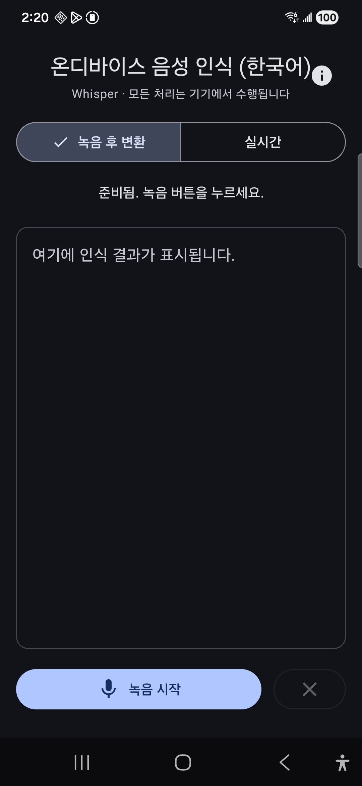
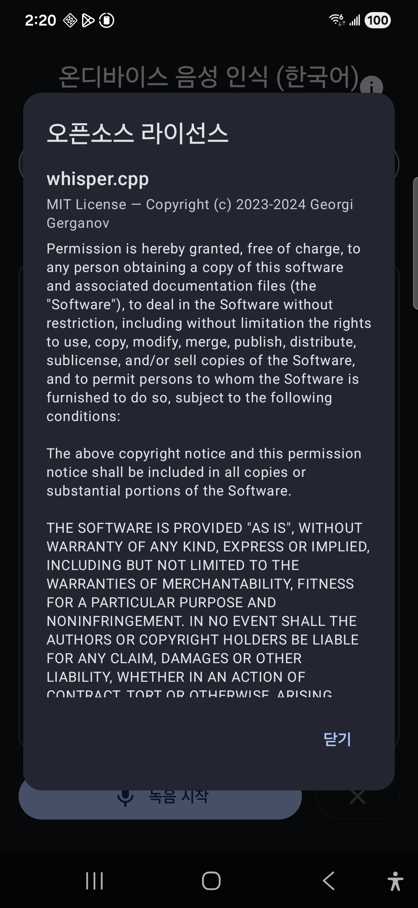

# STTonDevice

> 저장소: `ondevice-stt-android` · 앱 표시명: "STT 온디바이스"

Whisper 기반 **온디바이스(완전 오프라인) 한국어 음성 인식** 안드로이드 앱.
모든 처리는 기기에서 수행되며, 음성 데이터는 외부로 전송되지 않습니다.

| 메인 | 오픈소스 라이선스 |
|---|---|
|  |  |

## 주요 기능

- **온디바이스 STT**: [whisper.cpp](https://github.com/ggerganov/whisper.cpp)(C++/JNI) 사용, multilingual **base** 모델
- **한국어 인식** (`language=ko`)
- **두 가지 변환 방식** (UI에서 선택)
  - 녹음 후 변환(batch): 녹음 종료 후 전체를 한 번에 변환 (정확도 우선)
  - 실시간 스트리밍: 에너지 기반 VAD로 발화 구간을 나눠 점진 표시
- **노이즈 억제**: [RNNoise](https://github.com/xiph/rnnoise)(Xiph) 신경망 디노이즈 (48kHz 처리 → 16kHz 다운샘플)

## 요구 환경

- Android Studio (AGP 8.7.x), JDK 17
- Android SDK Platform 35, **NDK 27.x**, CMake 3.22.1
- 대상 ABI: **arm64-v8a** (실기기 권장). 기본 빌드는 arm64-v8a만 포함하므로 x86_64 에뮬레이터를 쓰려면 `abiFilters`에 ABI 추가 필요
- minSdk 26 / targetSdk 35

## Clone

외부 소스(whisper.cpp, rnnoise)는 **git 서브모듈**입니다. 반드시 서브모듈까지 받으세요.

```bash
git clone --recursive https://github.com/raposeidon/ondevice-stt-android.git
# 이미 clone 했다면
git submodule update --init --recursive
```

## 빌드 & 실행

```bash
./gradlew :app:assembleDebug
# 설치
adb install -r app/build/outputs/apk/debug/app-debug.apk
```

- `local.properties` 는 저장소에 포함되지 않습니다. Android Studio가 자동 생성하거나 `sdk.dir` 을 직접 지정하세요.
- **RNNoise 경량 모델 가중치**(`rnnoise_data_little.c`)는 git 에 없으며, **빌드 시 CMake 가 자동 다운로드·검증·추출**합니다(최초 빌드 시 네트워크 필요).

## 모델 준비 (ggml-base.bin, 약 147MB)

모델은 APK에 포함되지 않으며 다음 순서로 해석됩니다 (`ModelManager.kt`):

1. **앱 전용 외부 경로** `/sdcard/Android/data/com.example.sttondevice/files/ggml-base.bin` (있으면 사용)
2. 내부 저장소(이전 다운로드분)
3. 둘 다 없으면 **첫 실행 시 자동 다운로드** (Hugging Face)

재설치(`install -r`)는 데이터를 보존하므로 재다운로드하지 않습니다. 완전 제거 후에도 인터넷 없이 쓰려면 미리 push:

```bash
adb push ggml-base.bin /sdcard/Android/data/com.example.sttondevice/files/ggml-base.bin
```

## 구조

```
app/src/main/
├── java/com/example/sttondevice/   # 앱 로직 + Compose UI
│   ├── MainActivity.kt             #   UI(모드 토글, 녹음/변환, 라이선스 화면)
│   ├── MainViewModel.kt            #   상태 머신, batch/streaming 분기
│   ├── Recorder.kt                 #   MIC 48kHz → RNNoise → 16kHz
│   ├── StreamingTranscriber.kt     #   실시간 VAD 분할 + 순차 변환
│   ├── Denoiser.kt                 #   RNNoise JNI 래퍼
│   └── ModelManager.kt             #   모델 경로 해석/다운로드
├── java/com/whispercpp/whisper/    # whisper.cpp Kotlin 래퍼
└── cpp/                            # 네이티브
    ├── jni.c                       #   whisper + RNNoise JNI
    ├── CMakeLists.txt              #   모델 자동 다운로드 포함
    ├── whisper.cpp/                #   서브모듈 (ggerganov/whisper.cpp)
    └── rnnoise/                    #   서브모듈 (xiph/rnnoise / 모델은 빌드 시 다운로드)
```

## 처리 흐름

RNNoise 디노이즈(MIC 48k → RNNoise → 16k)는 두 모드 공통 경로입니다.

```
[공통]    Recorder: MIC 48kHz → RNNoise 디노이즈 → 16kHz
[batch]   (정제된 16k 누적) → stop → WhisperContext.transcribeData(ko)
[stream]  (정제된 16k 프레임) → StreamingTranscriber(VAD, 30초 윈도우 정렬) → 순차 transcribeData → 누적 표시
```

## 라이선스

- **앱 코드**: MIT License ([LICENSE](LICENSE), © 2026 raposeidon)

서드파티 소스는 서브모듈로 참조하며 각자의 라이선스를 따릅니다 (앱 내 "오픈소스 라이선스" 화면에서도 확인 가능):

- **whisper.cpp** — MIT License
- **ggml** (whisper.cpp에 포함) — MIT License
- **RNNoise** — BSD 3-Clause License (Xiph.Org)
